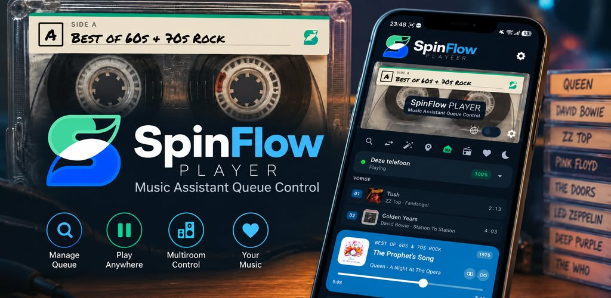
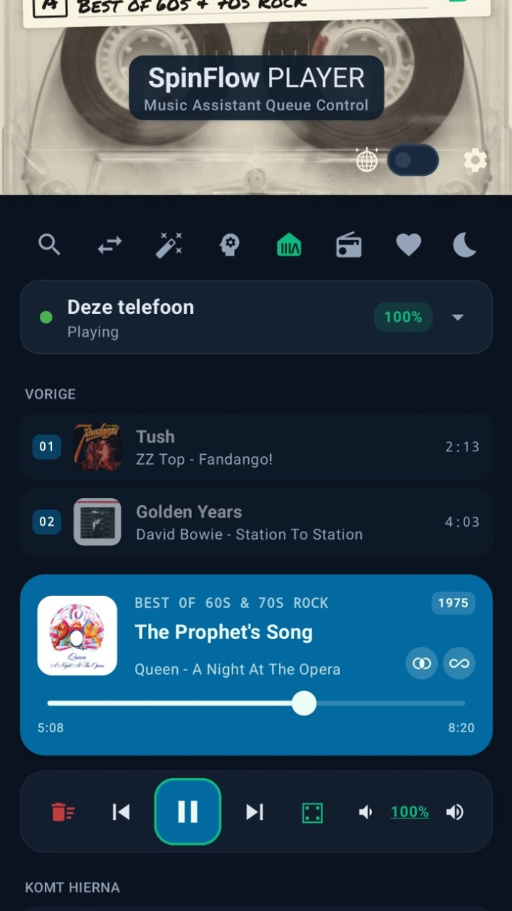
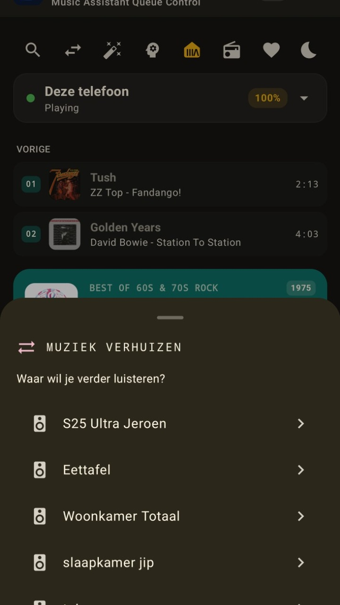
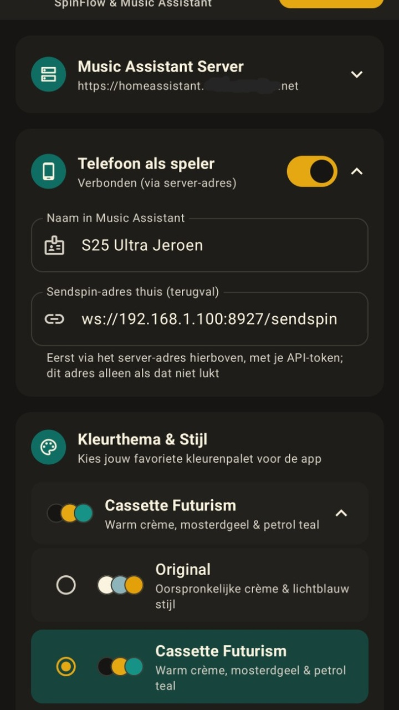

  

# SpinFlow Player

**Music Assistant Queue Control**: een native Android-app voor je [Music Assistant](https://music-assistant.io/) server.

  

  

SpinFlow is een snelle, betrouwbare bediening voor Music Assistant (MA), los van de Home Assistant Ingress-proxy, met slimme functies voor thuisgebruik: wachtrijbeheer, radio met live nummerinfo, groepsvolume, zoeken, een AI Radio DJ en een cassettebandje dat meedraait met je muziek.

  
  &nbsp;
  
  &nbsp;
  

  
  &nbsp;
  
  &nbsp;
  

## Het cassettebandje 📼
Boven in het scherm zit een cassettebandje dat laat zien wat er speelt:
- **Draaiende spoeltjes**: de spoeltjes **draaien zolang er muziek speelt** en **staan stil zodra de muziek pauzeert of stopt**, zodat je in één oogopslag ziet of er iets klinkt.
- **Handgeschreven etiket**: op het bandje zit een papieren sticker waarop de naam van de playlist, het album of de radiozender met stift is geschreven, net als op zelf opgenomen bandjes van vroeger.
- **Side A of Side B**: bij elke nieuwe playlist, album of zender kiest de app willekeurig of je naar kant A of kant B luistert.
- **Kleurt mee met je thema**: de bies bovenaan het etiket en het S-logo erop hebben de steunkleur van het gekozen thema (het "oog" van de S in papierkleur, zodat de vorm leesbaar blijft).
- **Disco & instellingen**: rechtsonder op het bandje zitten de disco-schakelaar 🪩 en het tandwiel voor de instellingen.
- **Liever compact?** Zet in Instellingen de *Compacte Minimalist Header* aan voor een slanke balk met logo in plaats van het bandje.

## Kleurthema's 🎨
Kies in Instellingen uit tien thema's: **Original**, **Cassette Futurism**, **Midnight Synthwave**, **Deep Emerald**, **OLED Minimalist**, **Retro Sunset**, **Amber Terminal**, **Espresso Mocha**, **Lavendel Dream** en **Rosé Blush**. De steunkleur van het thema komt overal terug, tot en met het Music Assistant-icoon in de iconenbalk (dat de MA-webinterface opent).

## Nieuw: AI Radio DJ (Beta) 🎙️
De app bevat nu een experimentele **AI Radio DJ** die je playlists aan elkaar praat:
- **ElevenLabs Integratie**: Gebruikt de hoogwaardige stemmen van ElevenLabs via Home Assistant.
- **Aanpasbare Stijl**: Kies uit verschillende stijlen zoals 'Enthousiast', 'Grappig' of 'Zakelijk'.
- **Vrije Instructies**: Geef de DJ specifieke opdrachten mee (bijv. "Vertel iets over het weer" of "Maak een grapje over de band").
- **Live-status**: Of er een DJ actief is op de gekozen speler komt uit `ai_radio/queue_dj/status`. Welke commando's de AI Radio-plugin precies kent, zie je op je eigen server onder `/api-docs/commands`.

## Belangrijkste Functionaliteiten

### 1. Slimme Locatie-beveiliging (Geofencing)
De app is zich bewust van zijn locatie om de interface schoon en relevant te houden:
- **Dynamische Filtering**: Kies in de instellingen welke speakers als "lokaal" worden beschouwd. Deze worden automatisch verborgen als je meer dan **150 meter** van huis bent.
- **Configureerbare Thuislocatie**: Pin je eigen thuislocatie eenvoudig via het instellingenscherm.
- **Afstandsweergave**: Toont de actuele afstand tot huis wanneer je buiten het bereik bent.

### 2. Geavanceerd Volume-beheer & Aliassen
- **Hardware Knoppen**: De volumeknoppen van je telefoon bedienen direct de actieve speler. In de instellingen vink je eenvoudig aan voor welke spelers dit actief moet zijn.
- **Groepsvolume**: Bij groepsspelers (sync groups zoals "Eettafel" of "Woonkamer Totaal") regelen de +/−-knoppen het groepsvolume via `players/cmd/group_volume`, net als de schuif in de Music Assistant-webinterface, en tonen ze het echte groepsvolume in plaats van 0%.
- **Stappen van 5% & echt stil bij 0%**: Volume gaat in stappen van 5%. Op 0% is de speler echt stil: losse spelers worden ook gemute, en bij een groep die al op 0 staat stuurt de app eerst kort 1% zodat de 0 echt bij de speakers aankomt.
- **Volume per speler**: Tik bij een groep op het volumegetal (onderstreept) en er opent een schermpje met elke speler uit de groep, elk met een eigen schuif en −/+-knoppen (stappen van 5%). De Hue-discospeler wordt daar niet getoond.
- **Disco-schakelaar** 🪩: Rechtsonder op het cassettebandje, naast het tandwiel, staat een schakelaar met een discobal. Aan voegt de Hue-lichtspeler "Hue: disco woonkamer" toe aan de groep van de gekozen speler (zodat de lampen meebewegen op de muziek), uit haalt hem er weer uit. De stand volgt wat Music Assistant rapporteert.
- **Speler Aliassen**: Geef je speakers eigen "roepnamen" (bijv. "Yamaha Living" -> "Woonkamer") die overal in de app worden gebruikt.
- **Slimme Spelerkeuze**: De dropdown sorteert spelers die nu spelen bovenaan (meest recent gestart eerst), gevolgd door spelers met een geladen wachtrij, en de rest alfabetisch. Bij het eerste opstarten kiest de app om dezelfde reden ook zo'n speler als standaard, in plaats van gewoon de alfabetisch eerste.
- **Spelers verbergen**: Vink in Instellingen onder "Spelers in keuzelijst" spelers uit die je nooit gebruikt; ze verdwijnen uit de dropdown (de actief geselecteerde speler blijft altijd zichtbaar).

### 3. Player Experience
- **Compact & Elegant**: De interface is geoptimaliseerd voor gebruiksgemak met een slanke "Nu Spelend" balk en compacte dropdowns.
- **Music Wizard**: Een handige stapsgewijze hulp om snel een speler te kiezen en je favoriete muziek te starten.
- **Wachtrijbeheer**: Bekijk tot wel 50 nummers in de wachtrij, skip, shuffle (geanimeerde dobbelsteen) of wis de lijst.
- **Wachtrij slepen**: Elk "Komt hierna"-nummer heeft een sleep-handle in de lijst zelf; bij loslaten volgt één `player_queues/move_item` met de netto verschuiving.
- **Muziek Verhuizen (Transfer)**: Verplaats je actuele wachtrij met één klik naar een andere speler.
- **Releasejaar**: Naast de titel van het nu spelende nummer verschijnt, waar bekend, het releasejaar — uit Music Assistant's eigen metadata, of anders (bijv. bij radio) via een gefilterde iTunes-zoekopdracht met caching per zoekterm.
- **Vloeiende voortgangsbalk**: De positie loopt lokaal door tussen de serverpolls in, zodat de balk soepel meebeweegt in plaats van te verspringen.
- **Spoelen**: Versleep de voortgangsbalk om naar een ander punt in het nummer te springen; het spoel-commando gaat pas naar de server als je loslaat.
- **Zoeken** 🔍: Zoek op artiest, titel, album of afspeellijst via Music Assistant (`music/search`). Resultaten staan per categorie (nummers, artiesten, albums, afspeellijsten); albums tonen hoes, artiest en jaartal. Alles kun je direct afspelen of als volgende in de wachtrij zetten.
- **Filter op provider**: Onder het zoekveld staan chips (Alle, Spotify, YouTube Music, Bandcamp, Lokale bestanden, …) met de providers die in de resultaten voorkomen. Een bibliotheek-item telt mee voor elke provider waaraan het gekoppeld is (`provider_mappings`).
- **Crossfade & Autoplay**: Rechtsonder in de "Nu Spelend"-kaart staan twee icoontjes waarmee je crossfade (`player_queues/crossfade`) en autoplay, het vroegere "Don't stop the music" (`player_queues/autoplay`), van de wachtrij aan- of uitzet. Aan = fel icoon met een rondje erachter.
- **Playlist-hoezen**: Afbeeldingen die alleen op de MA-server staan (bijv. eigen collages of het MA-logo bij dynamische playlists) lopen via MA's imageproxy (`/imageproxy/<proxy_id>`). Heeft een favoriete playlist helemaal geen afbeelding, dan maakt de app een 2×2-collage van de hoezen van de eerste nummers.
- **Meest gekozen bovenaan**: Favoriete afspeellijsten en radiozenders worden gesorteerd op hoe vaak je ze kiest (daarna alfabetisch). De tellingen blijven bewaard tussen app-herstarts.
- **Slaaptimer** 🌙: Zet via de maan-knop een timer op 15/30/45/60/90 minuten. Een chip toont de resterende tijd; daarna pauzeert de muziek automatisch.
- **Lockscreen- & bluetooth-bediening**: Een `MediaSession` toont het nu spelende nummer met hoes in de notificatiebalk en op het lockscreen. Play/pauze/vorige/volgende werken daar en via bluetooth-, koptelefoon- en autoknoppen; de commando's gaan naar Music Assistant en de status komt terug in de notificatie.

### 4. Radio 📻
- **Nu spelend nummer**: Bij een radiostream toont de app niet alleen de zendernaam, maar ook de live artiest, songtitel en (indien meegestuurd) het album — net als in Music Assistant zelf. Data komt uit `streamdetails.stream_metadata`, met de ICY `stream_title` ("Artiest - Titel") als terugval.
- **Wisselende hoes**: Standaard de albumhoes van het huidige nummer (met iTunes-terugval als de stream er geen meelevert); elke ~30 seconden verschijnt ~5 seconden lang het zenderlogo.
- **Eerder op deze zender**: Een lijstje met de laatste ~50 nummers die op de zender voorbijkwamen, inclusief het nummer dat nu speelt. Blijft bewaard tussen app-herstarts en wist zichzelf pas bij een echte zenderwissel (niet tijdens het tijdelijk onderbreken van de stream om een geschiedenisnummer af te spelen, en ook niet als je tussendoor een playlist of AI Radio luistert: dan wordt de lijst alleen verborgen). Tik op een nummer en de app zoekt het op in Music Assistant, speelt het nu af op de radio-speler en zet de zender er direct achteraan zodat de stream vanzelf hervat. Via het hartje sla je de geschiedenis (inclusief het huidige nummer) op als favoriete afspeellijst, onder de naam van de zender zoals die nu op het scherm staat.

### 5. Telefoon als speler 📱
De telefoon kan zelf een Music Assistant-speler zijn: MA speelt dan muziek af op de telefoon, ook met de app op de achtergrond en zonder de MA-webinterface open te hebben.
- **Aanzetten**: In Instellingen staat de kaart *Telefoon als speler* met een schakelaar, de naam waaronder de telefoon in MA verschijnt (standaard de appnaam plus het toestelmodel, bijv. "SpinFlow Pixel 8", zodat meerdere toestellen en de Playground-app in MA uit elkaar te houden zijn) en een statusregel (bijv. "Verbonden (via server-adres)" of de reden waarom het niet lukt).
- **Vaste speler**: De app maakt eenmalig een vaste client-ID aan, zodat MA steeds dezelfde speler ziet. In de spelerslijst staat hij bovenaan als **"Deze telefoon"** met een telefoon-icoon.
- **Verbinding**: Via [Sendspin](https://github.com/Sendspin): eerst via het server-adres (bijv. over Tailscale) naar `wss://<server>/sendspin`, met het API-token als eerste `auth`-bericht; lukt dat niet, dan thuis rechtstreeks naar de Sendspin-poort (`ws://<MA-host>:8927/sendspin`, instelbaar). Bij mislukken probeert de app het opnieuw met oplopende wachttijd (5 s tot 60 s).
- **Afspelen**: Ongecomprimeerde PCM via `AudioTrack`, getimed op de klok van de server zodat de telefoon in de pas blijft met andere spelers; kleine afwijkingen worden onhoorbaar bijgestuurd.
- **Achtergrond & batterij**: Een foreground-service met mediamelding (Media3) houdt de speler actief. Wake- en wifilock worden alleen vastgehouden zolang er echt muziek binnenkomt.
- **Lockscreen**: Titel, artiest, album en hoes; play/pauze/vorige/volgende gaan als commando naar MA.
- **Andere geluiden**: Bij een navigatie-aanwijzing gaat de muziek zachter, bij een telefoongesprek is alleen de telefoon even stil (een groep in huis speelt gewoon door). Start een andere muziek-app, dan pauzeert MA.
- **Let op**: De Sendspin-bibliotheek (`sendspin-jvm`) ondersteunt nog geen Noise-encryptie. MA 2.10 accepteert zulke "legacy" clients nog; in latere MA-versies kan dat verdwijnen.
- **Mobiel netwerk**: Zonder (gevalideerde) wifi vraagt de app MA om ~3 s extra buffer en een grotere buffercapaciteit (1 MB i.p.v. 256 KB), zodat korte dipjes in de mobiele verbinding niet hoorbaar zijn. Op wifi blijft alles als voorheen.

### 5a. Android Auto 🚗
De telefoon-als-speler is ook een mediabron voor Android Auto (Media3 `MediaLibraryService`). Wat je in de auto kiest, speelt MA af op deze telefoon; de app zelf ziet er niet anders uit.
- **Bladeren**: *Favorieten* (favoriete playlists) en *Radio* (favoriete zenders), met hoezen. De hoezen gaan via een eigen `ArtworkProvider`, omdat Android Auto het API-token niet kent; die geeft alleen afbeeldingen door.
- **Zoeken**: In de auto zoeken (of "Hey Google, speel … op SpinFlow") doorzoekt de MA-bibliotheek; bij een gesproken opdracht speelt de beste treffer (exacte naam, anders het eerste nummer).
- **Wachtrij**: De MA-wachtrij (2 vorige + tot 50 volgende) staat in de wachtrijweergave; tik op een nummer om erheen te springen.
- **Knoppen**: Shuffle, herhalen (uit → alles → één) en favoriet maken. Alleen zichtbaar zolang Android Auto verbonden is; melding en lockscreen van de telefoon blijven verder ongewijzigd.
- **Telefoon als speler uit?** Dan doet de telefoon tijdelijk mee zolang Android Auto verbonden is; de instelling blijft uit.

### 6. Techniek & Connectiviteit
- **Rechtstreekse Verbinding**: Commando's gaan via JSON-RPC (`POST /api`) direct naar de Music Assistant server; HA-services via de REST API.
- **Push i.p.v. pollen**: Een WebSocket (`wss://<server>/ws`) authenticeert met een `auth`-commando en levert daarna live events (`player_updated`, `queue_updated`, …). De app ververst binnen ~250 ms op zo'n event i.p.v. elke paar seconden te pollen. Er blijft een trage heartbeat (30 s) als vangnet; valt de socket weg, dan schakelt de app terug naar snel pollen (3 s) en verbindt automatisch opnieuw met oplopende backoff. Er is altijd maar één socket: opnieuw verbinden gebeurt alleen bij een echt ander server-adres of token, en meldingen van een al vervangen socket worden genegeerd.
- **Portrait Only**: De app blijft altijd in staande stand voor een consistente ervaring.
- **Sessie Management**: Houdt je Music Assistant-sessie op de achtergrond actief.
- **Artwork-cache**: iTunes-hoeszoekopdrachten worden per zoekterm onthouden om onnodig netwerkverkeer te voorkomen.

## Logo
Het S-logo staat in `docs/logo/` als SVG en als PNG van 1024 en 2048 px (bijv. voor de Play Store-vermelding). In de app zit het als vector-drawable: `ic_spinflow` (met donkere achtergrond, in de compacte header) en `ic_spinflow_mark` (zonder achtergrond, voor het app-icoon op `#0E1B34` en, in de steunkleur, het cassette-etiket) en `ic_spinflow_eye` (alleen het oog, als uitsparing op het etiket).

## Installatie & Configuratie voor Ontwikkelaars

1. **Android Studio**: Open dit project in Android Studio (Ladybug of nieuwer).
2. **Command line (optioneel)**: De Gradle-wrapper zit in de repo, dus `./gradlew assembleDebug` (of `gradlew.bat` op Windows) bouwt een debug-APK zonder Android Studio. Nodig: JDK 17 (bijv. de JBR van Android Studio). `sendspin-jvm` komt via JitPack.
3. **Server Instellen**: Bij de eerste start vraagt de app om de URL van je Music Assistant server en een Access Token. Hetzelfde token wordt gebruikt voor *Telefoon als speler*.
4. **Locatie**: Geef toestemming voor locatiegebruik voor de slimme filtering.

---
*Ontwikkeld voor eigen gebruik door Jeroen van Sonsbeek (jeroenvansonsbeek@gmail.com).*
